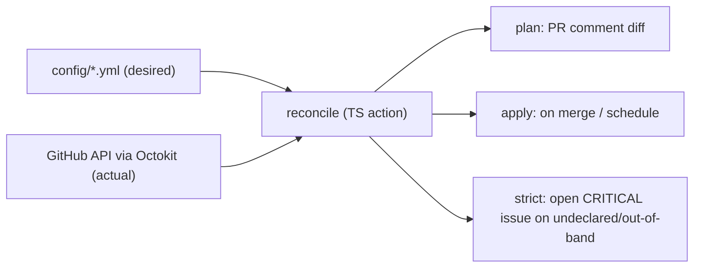

# [Issue 1]: [[DISCUSSION] org-config: GitHub organization configuration as code](https://github.com/vig-os/org-config/issues/1)

## Description

This issue frames the design of **org-config**: a self-contained, stateless GitHub configuration-as-code tool for managing the `vig-os` organization declaratively — who has access to which repos, which rules apply where, and how org/repo settings are enforced.

The tool should be **forkable** so other organizations (`exo-pet`, `exoma-ch`, `MorePET`, …) can adopt the same engine with their own configuration data.

---

## Context / Motivation

The `vig-os` organization provides an operating stack for development and operation of scientific labs. As the org grows, manual GitHub administration becomes error-prone, unauditable, and inconsistent across repos.

We need a single declarative source of truth for:

- Org-level settings and team membership
- Repository access (teams, collaborators, permission levels)
- Repository settings (features, merge strategy, visibility, metadata)
- Branch protection / rulesets
- Secrets and variables (without committing plaintext)
- Drift detection when settings change outside the repo

This aligns with vigOS principles: **config as code**, **single source of truth**, and **compliance-friendly audit trails** (ties into `qms` and medtech governance requirements).

---

## Goals

1. **Declarative org governance** — YAML (or similar) config in git defines the desired state of the `vig-os` GitHub organization.
2. **GitOps workflow** — changes via pull request; plan posted as PR comment; apply on merge to `main`; scheduled reconciliation for drift.
3. **Strict reconciliation** — anything not declared in config, or changed out-of-band, triggers a **critical issue** (labels: `drift`, `critical`). No silent drift.
4. **Self-contained** — no AWS, no Terraform state backend, no hosted application. GitHub itself is the runtime and the live state; the repo holds desired state.
5. **Fork-friendly** — downstream orgs fork the repo, replace `config/` with their own data, configure a GitHub App, and run the same reusable workflow.
6. **Compliance-ready** — every change traces to a PR, commit, and issue; separation of duties via CODEOWNERS and required reviews on this repo.
7. **Secret management without plaintext** — encrypted values (SOPS/age) committed in-repo; decrypted only at apply time in Actions.

---

## Prior Art

| Approach | Summary | Why not (for our constraints) |
|----------|---------|-------------------------------|
| [Terramate + Terraform](https://medium.com/terramate/how-to-manage-your-github-organization-with-terraform-1b584b2ea177) | Terraform `integrations/github` provider with Terramate orchestration | Requires external state backend (S3, TF Cloud, …); state may contain secrets; adds AWS/cloud dependency we want to avoid |
| [xebis/github-organization-as-code](https://github.com/xebis/github-organization-as-code) | YAML config + reusable GitHub Actions + Terraform + S3 state | Same state-backend dependency; otherwise a good GitOps pattern to borrow (reusable workflows, YAML config) |
| [GitHub Safe-Settings](https://arctiq.com/blog/managing-repository-settings-with-github-safe-settings) | Probot app; policy-as-code via YAML in an admin repo | No secrets/variables management; requires hosted app or scheduled runner; cannot open critical issues on drift; less control over strict reconciliation semantics |
| [Managing a GitHub Org with IaC (HackerNoon)](https://hackernoon.com/managing-a-github-organization-with-infrastructure-as-code) | General Terraform approach to org management | Same Terraform/state trade-offs; good conceptual reference |
| [ipdxco/github-as-code](https://github.com/ipdxco/github-as-code) | Mature template: Terraform + codegen importer + multi-org router | Most complete prior art, but Terraform-centric with external state; excellent reference for config schema, codegen/auto-scan, and multi-org patterns |

**Key takeaway:** borrow GitOps workflow and YAML config patterns from the Terraform-based tools; implement a **custom reconciler** to avoid external state dependencies.

---

## Chosen Approach

**Custom Octokit TypeScript reconciler** — consistent with existing in-house GitHub Actions (`commit-action`, `sync-issues-action`).

### How it works



1. **Read desired state** from `config/*.yml` in the repo.
2. **Read actual state** from the GitHub API (Octokit) on each run.
3. **Diff** desired vs actual.
4. **Plan mode** (PR): post diff as PR comment; no mutations.
5. **Apply mode** (merge to `main`): reconcile GitHub to match config.
6. **Drift mode** (scheduled): detect out-of-band changes or undeclared resources; open a critical issue.

### Why stateless

- No `.tfstate`, no S3, no TF Cloud.
- GitHub API is always the source of truth for *actual* state.
- Desired state lives in git — already versioned, auditable, reviewable.
- Each run is idempotent: read → diff → apply.

---

## Strict Reconciliation Behavior

When the reconciler runs in drift-detection mode:

| Condition | Action |
|-----------|--------|
| Repo exists in org but not in config | Open critical issue: "Undeclared repository: `<name>`" |
| Team/collaborator permission not in config | Open critical issue with details |
| Setting differs from config (changed via UI/API) | Open critical issue: "Drift detected: `<resource>`" |
| Config declares resource that doesn't exist | Apply mode creates it; plan mode shows it in diff |

Issues are labeled `drift` + `critical`. Duplicate issues for the same drift should be deduplicated (update existing, don't spam).

**Open question:** should drift also trigger auto-revert, or issue-only? (See Open Questions below.)

---

## Secret Management

Secrets and variables must be manageable as code without plaintext in git.

**Proposed approach: SOPS + age**

- Encrypted secret values committed in `config/secrets/` (or inline in config with `sops:` markers).
- Age private key stored as GitHub Actions secret (`SOPS_AGE_KEY`).
- Reconciler decrypts at apply time only; never logs decrypted values.
- Rotation: update encrypted file via PR, re-apply.

Alternatives to discuss: passthrough from this repo's own Actions secrets (simpler, but secrets not fully "as code"), external vault (adds dependency).

---

## Auth & Self-Protection

### GitHub App (recommended over PAT)

- Org-scoped, fine-grained permissions, no human token dependency.
- Permissions needed (draft): Administration (read/write) on repos and org, Members (read), Actions secrets (read/write), etc.
- App private key stored as Actions secret (`GH_APP_PEM_FILE`).

### Protecting this repo

Write access to `org-config` ≈ administrative control over the org. Safeguards:

- Branch protection on `main` (required reviews, no force-push).
- `CODEOWNERS` requiring org-owner approval.
- Required status checks (plan must pass before merge).
- Audit log: every apply traces to a merged PR.

---

## Forkability / Multi-Org Reuse

Structure for downstream orgs (`exo-pet`, `exoma-ch`, `MorePET`):

```
org-config/
├── action/              # TypeScript reconciler (Octokit)
├── .github/workflows/
│   ├── plan.yml         # Reusable: plan on PR
│   ├── apply.yml        # Reusable: apply on merge
│   └── drift.yml        # Reusable: scheduled drift check
├── config/
│   ├── org.yml          # Org-specific desired state (fork replaces this)
│   ├── repos/
│   │   ├── devcontainer.yml
│   │   └── ...
│   └── teams/
│       └── ...
├── schema/              # JSON Schema for config validation
└── docs/
```

Downstream org forks, replaces `config/`, sets GitHub App credentials and Actions secrets, calls reusable workflows. Optionally mark repo as **GitHub template** for one-click fork.

---

## Managed Surface (Phased)

### Phase 1 — Foundation
- Org settings (default permissions, member privileges)
- Teams: create, membership, team → repo permissions
- Repositories: create, metadata (description, topics, visibility), features (issues, wiki, projects), merge settings
- Standardized labels across repos
- Config schema validation in CI
- Plan / apply / drift workflows

### Phase 2 — Security & Secrets
- Rulesets / branch protection (required reviews, status checks, signed commits, bypass actors)
- Org and repo secrets & variables (SOPS/age)
- Deployment environments (branch policies, required reviewers)
- Self-protection: branch protection and CODEOWNERS on `org-config` itself

### Phase 3 — Compliance & Scale
- Custom repository properties (definitions + values)
- Org security defaults (secret scanning, Dependabot, code scanning)
- **Auto-scan / codegen importer**: scan all repos in org, generate initial config (ipdxco-style)
- Drift notifications (Slack, email, or issue-only)
- Policy assertions for `qms` compliance evidence (e.g. "all repos must require 2 reviewers")

---

## Open Questions

1. **Drift response:** issue-only vs auto-revert? Strict mode currently proposes issue-only to avoid destructive surprises; auto-revert could be opt-in per resource type.
2. **Allow-list:** should some repos be excluded from strict reconciliation (e.g. experiments, forks like `vs-dolt`)? How to declare `managed: false`?
3. **Notification channel:** critical drift issues only, or also Slack/email?
4. **Secret backend:** confirm SOPS/age vs passthrough Actions secrets for v1.
5. **Repo creation policy:** should the tool be the *only* way to create repos (block manual creation), or just flag undeclared ones?
6. **Discussion location:** should ongoing architecture decisions live here or cross-link to `vig-os/meta`?
7. **Importer scope:** full org import on bootstrap, or repo-by-repo adoption?

---

## Proposed Roadmap

| Milestone | Scope | Outcome |
|-----------|-------|---------|
| **M0 — Bootstrap** | Repo scaffold, config schema, GitHub App setup docs, plan-only workflow | Can validate config and post plan diffs on PR |
| **M1 — Phase 1** | Teams, repo settings, labels, apply workflow | Can manage org access and repo settings via PR |
| **M2 — Phase 2** | Rulesets, secrets (SOPS), environments, self-protection | Security policies and secrets as code |
| **M3 — Phase 3** | Importer, drift notifications, compliance assertions | Full org bootstrap and ongoing strict reconciliation |

---

## Options / Alternatives Considered

1. **Terraform + `integrations/github`** — most complete provider coverage, but requires state backend (rejected: external dependency).
2. **GitHub Safe-Settings** — mature, GitHub-native, but no secrets management and limited drift semantics (rejected: insufficient for strict mode).
3. **Custom Octokit TypeScript reconciler** — stateless, self-contained, fits in-house action style, full control over strict reconciliation (chosen).

---

## Related Issues

- [vig-os/meta#1](https://github.com/vig-os/meta/issues/1) — Organization of the meta repo (coordination hub; this tool complements meta's governance role)

---

**Changelog category:** No changelog needed (discussion only)

---

# [Comment #1]() by [c-vigo]()

_Posted on July 6, 2026 at 10:14 AM_

## Reevaluation (2026-07): two premises of the chosen approach no longer hold

Deep-dive reevaluation of the options above, verified against the live orgs and current upstream sources. Summary: **the goal stands; the architecture should change from "build a full Octokit reconciler" to "adopt an existing stateless engine, build only the strict-drift layer".**

### Premise 1 — "Terraform requires an external state backend": stale

- **OpenTofu ≥ 1.7** natively encrypts state/plan files client-side ([docs](https://opentofu.org/docs/language/state/encryption/)): PBKDF2 passphrase from an Actions secret, encrypted `tfstate` committed in-repo. No S3, no TF Cloud.
- [`terraform-backend-git`](https://github.com/plumber-cd/terraform-backend-git) (v0.1.11, 2026-03) stores state in a git repo with SOPS/age encryption and branch-based locking.
- Provider coverage gaps closed: `integrations/github` **v6.12** (2026-04) added all five custom-property types and custom-property-targeted **organization rulesets** ([#2137](https://github.com/integrations/terraform-provider-github/issues/2137) → [#2356](https://github.com/integrations/terraform-provider-github/pull/2356)).

The prior-art table's main rejection rationale is therefore obsolete.

### Premise 2 — the design assumes features our orgs cannot use (plan gating)

All four target orgs (`vig-os`, `exo-pet`, `exoma-ch`, `MorePET`) are on the **Free plan**. Verified live (2026-07-06):

- Branch protection **and** repo rulesets on a private repo (`exo-pet/exopet-daq`) → `HTTP 403 "Upgrade to GitHub Pro or make this repository public"`. Free-plan UI lets you *create* rulesets on private repos but they are **not enforced**.
- **Org-level rulesets require Team+** (since [2025-06-16](https://github.blog/changelog/2025-06-16-organization-rulesets-now-available-for-github-team-plans/)); a Free org cannot create them at all, even for public repos.
- CODEOWNERS on private repos: Pro/Team+. Environment required-reviewers on private repos: Enterprise-only.

Consequence: `exo-pet` (8/9 repos private, medtech, "git history is part of the audit record") has **no enforceable branch protection anywhere today**, and Phase 2 (rulesets) is impossible for exactly the org that needs it most. No reconciler fixes a billing gate. → **P0, before any tooling: upgrade `exo-pet` to GitHub Team (3 seats ≈ $12/mo)**; also fix `MorePET`'s `default_repository_permission=admin` immediately.

### Options, reevaluated

| Option | State | Coverage | Drift | Verdict |
|---|---|---|---|---|
| [**Otterdog**](https://github.com/eclipse-csi/otterdog) (v1.3.4, 2026-06) | **Stateless** — config repo inside the managed org, live API diff | Org settings/webhooks/secrets/variables/org rulesets; repo settings/BP/rulesets/secrets/variables/environments/custom properties. No teams/members | plan/diff on PR; no issue-opening daemon | **Adopt as engine.** It *is* this issue's architecture, already built: production-proven on ~310 Eclipse orgs, EPL-2.0, Python. Caveats: Jsonnet; low bus factor (pin + fork as insurance) |
| OpenTofu + `integrations/github` v6.12+ | Encrypted state in-repo | Widest (incl. teams/membership) | `plan -detailed-exitcode`; blind to undeclared repos | Strong fallback if Otterdog misfits |
| [Safe-Settings](https://github.com/github/safe-settings) (v2.1.21) | Stateless (admin repo) | Repo-targeted; org-targeted: rulesets only | **Silent auto-revert**, webhook best-effort, never opens issues | Rejected — drift philosophy is the opposite of "no silent drift"; needs hosted Probot service |
| [ipdxco/github-as-code](https://github.com/ipdxco/github-as-code) | Hard-coded AWS S3+DynamoDB | 9 resource types; no rulesets/secrets/org settings | Absorbs drift into config PRs | Disqualified — also **no LICENSE file** (unforkable), 0 releases |
| [Peribolos](https://docs.prow.k8s.io/docs/components/cli-tools/peribolos/) (kubernetes-sigs/prow) | Stateless CLI | Org settings/members/teams; no rulesets | Dry-run default, `--fix-*` flags, removal-delta guards | Ready-made complement for teams/members — defer (3 members, 0 teams) |
| Pulumi / Crossplane | DIY backend / k8s | Bridged from TF provider | scheduled preview / continuous | Extra runtime layers over the same provider; Crossplane needs a k8s cluster |
| **Custom Octokit reconciler** | Stateless | To be built | To be built | **Do not build in full** — see below |

### Adversarial case against the full custom reconciler

1. **Scale**: our largest shipped action is ~1k LOC (`sync-issues-action`); a full reconciler (org+teams+repos+rulesets+secrets, diff/plan/apply, drift + issue dedup) is realistically **8–12k LOC + tests**, requiring two capabilities with no in-house precedent (config-schema validation, diff/plan engine). One engineer; the opportunity cost is the scanner.
2. **Wrong bottleneck**: reconciliation is solved by existing engines. The genuinely unmet requirement — scheduled drift runs that open deduplicated `drift`+`critical` issues, and **undeclared-repo detection** — is a few-hundred-LOC wrapper around any engine's diff, not a reason to own the engine.
3. **Security**: the config repo is an org-admin backdoor regardless of engine (OWASP [CICD-SEC-4](https://owasp.org/www-project-top-10-ci-cd-security-risks/CICD-SEC-04-Poisoned-Pipeline-Execution)); bespoke bundled code holding org-admin App credentials *adds* unaudited supply-chain surface.
4. **GitHub keeps absorbing the niche natively**: org rulesets on Team, immutable releases GA org-wide (2025-10), required-reviewer ruleset rule GA (2026-02), Actions execution Policies preview (2026-06). Owning less code ages better.

### Revised architecture

- **Engine: Otterdog**, one config repo per org (its native model = our forkability goal), driven by our standard workflow style: plan-on-PR comment, apply-on-merge, GitHub App auth (all required permissions are App-capable; only repo transfer / App installs / billing are not).
- **Build in-house only the thin strict-drift layer**: scheduled `otterdog plan` + org-inventory sweep → deduplicated critical issues; absorb `setup-gh-repo.sh`, `label-taxonomy.toml`, `renovate-default.json` as config inputs; QMS evidence export (ADR-0005/0026 alignment). Reuse `sync-issues-action` App-auth + `commit-action` retry.
- **Secrets**: SOPS/age as proposed (confirmed — no existing tool does this better).
- **Self-protection**: this repo is public → rulesets + CODEOWNERS work on Free; apply gated via admin-restricted dispatch (environment required-reviewers would need Enterprise on private forks).
- **Repo tooling**: consume the Nix vigOS dev-shell (`mkProjectShell` + `sops`/`age`/`jsonnet`; otterdog via `uvx`) for humans; CI workflows stay self-sufficient on pinned `uvx otterdog` + `gh` so forks (and emergencies) never depend on the `vig-os/devcontainer` flake.

### Open questions, answered

1. Drift response → **issue-only** (auto-revert stays opt-in and far from a medtech org).
2. Allow-list → `managed: false` lives in the drift layer's inventory sweep.
3. Notifications → issues only for v1.
4. Secret backend → SOPS/age confirmed.
5. Repo creation → flag undeclared (Free plan cannot block creation anyway).
6. Decisions → **ADRs in this repo**, authored immediately after scaffolding and before any config/implementation lands: `docs/adr/NNNN-slug.md` (exo-fleet numbering) using the `vault/decisions/_template.md` content format (frontmatter, status enum, mandatory alternatives table, reviewers for Accepted, Corrections log) + a `README.md` index. Cross-repo decisions referenced as `<repo>#ADR-NNNN`, never copied. Seed set: 0001 engine choice, 0002 drift semantics, 0003 secrets backend, 0004 auth model, 0005 repo tooling. The exo-pet plan-upgrade decision belongs in `exo-pet/meta` and is cross-referenced.
7. Importer → `otterdog fetch-config` (and Peribolos `--dump` if teams ever materialize) replaces the Phase-3 codegen milestone.

### Revised roadmap

| Milestone | Scope |
|---|---|
| **M0** | Project scaffolding: Nix dev-shell + hooks + CI skeleton, branch protection/CODEOWNERS on this repo; exo-pet → Team plan; fix MorePET default permission; GitHub App setup |
| **M1** | **ADRs first** — record the decisions from this discussion in `docs/adr/` before any implementation, one reviewed PR each: 0001 engine choice, 0002 drift semantics, 0003 secrets backend, 0004 auth model, 0005 repo tooling |
| **M2** | Otterdog config for `vig-os` (import via `fetch-config`), plan/apply workflows |
| **M3** | Strict-drift layer (scheduled plan + inventory sweep → critical issues), SOPS/age secrets |
| **M4** | Fork to `exo-pet`/`exoma-ch`/`MorePET`; QMS evidence exports; absorb legacy imperative scripts |


---

# [Comment #2]() by [c-vigo]()

_Posted on July 17, 2026 at 09:03 AM_

## Implementation plan — v1.0.0 (2026-07-17)

The reevaluation above is adopted as the decided path: **Otterdog as engine, in-house code limited to the strict-drift layer.** This comment adds the decisions taken since, defines v1, and converts the discussion into tracked work. Milestones **M0–M4** and issues **#4–#26** are live; implementation proceeds issue → branch → PR from here.

### Decisions added since the reevaluation

**Distribution topology (→ ADR-0006, #13).** This repo stays **public** and is engine + template + vig-os's own config (dogfooding). **No private sibling**: vig-os's only private repo (`qms`) is declared by name in public config — low sensitivity, and every alternative (private overlay, unnamed exclusion) splits the source of truth or breaks the undeclared-repo sweep. Downstream orgs (`exo-pet`, `exoma-ch`, `MorePET`) each get a **private `org-config` repo created from template — never a fork** (GitHub forks of public repos cannot be private, and downstream doesn't want engine history). It lives **inside the org it governs** (the PR audit record belongs where it audits) and holds only config data + SOPS ciphertext + ~5-line caller workflows pinned to tagged reusable workflows here. Rejected: one central multi-org repo (Eclipse `otterdog-configs` model) — single blast radius across four orgs, and exo-pet's QMS needs its audit trail in its own org. **Sequencing rule:** a Free-plan private config repo has no enforceable protection yet is org-admin-equivalent → exo-pet upgrades to Team (#6) *before* its config repo gets write credentials; Free orgs onboard read-only (plan+drift) first.

**CI & testing (→ ADR-0007, #14).** Managed `ci.yml` is never edited — extension happens via `justfile.project` recipes and flake pre-commit hooks (jsonnetfmt, actionlint, zizmor, `otterdog validate`); plan/apply/drift are separate repo-owned workflows. Public-repo credential rules: plan on same-repo PRs only (forks get static checks), never `pull_request_target` with PR-head checkout, per-job least-privilege App tokens, environment-gated + concurrency-serialized apply. **Split cadence:** config applies from trunk (`dev`) on merge — governance changes shouldn't queue behind releases; the engine (reusable workflows, defaults library, drift action) releases through the devkit pipeline to `main` + tags for downstream pins. Test pyramid: **L0** static validation (forks OK) → **L1** unit tests of the drift layer over recorded plan fixtures (TDD; the otterdog version pin doubles as fixture-format stability) → **L2** real read-only `otterdog plan` against live vig-os on every same-repo PR (plan is non-mutating: free E2E read-path coverage) → **L3** scheduled mutation E2E on a sacrificial **`org-config-testbed`** repo declared in config (#23). Org-*level* settings are per-org singletons no dummy repo can cover — v1 accepts plan-only coverage there; a `vig-os-sandbox` org is deferred with named revisit triggers (org-level apply escape, or a pre-pilot rehearsal need).

**Versioning.** `DEVKIT_TAG_PREFIX=v` → releases tag as **`v1.0.0`** (this repo publishes actions-ecosystem artifacts; devkit #1044 convention). No floating major tags — downstream pins exact tags (or SHAs, recommended for exo-pet), bumped by Renovate.

### v1.0.0 definition

> The vig-os organization is fully declaratively managed from this repo — plan-on-PR, apply-on-merge, scheduled strict drift with deduplicated `drift`+`critical` issues, SOPS/age secrets — and the engine is consumable downstream, proven by a live exo-pet pilot.

Non-goals for v1 (deferred, not rejected): teams/membership management (Peribolos when teams materialize), auto-revert, notifications beyond issues, exoma-ch/MorePET rollout, QMS evidence export.

### Milestones

| Milestone | Issues | Checkpoint |
|---|---|---|
| **M0 — Prerequisites & self-protection** | #4 #5 #6 #7 | exo-pet ruleset API stops 403ing; App authenticates; this repo hardened; MorePET admin default removed |
| **M1 — ADRs** | #8–#14 | ADRs 0001–0007 Accepted and indexed, one reviewed PR each, before implementation |
| **M2 — vig-os under management** | #15 #16 #17 #18 #19 | Settings change via PR → plan comment shows exactly that diff → merge → live; out-of-band change surfaces in next plan |
| **M3 — Strict drift & secrets** | #20 #21 #22 #23 | Induced drift → exactly one issue; recurrence updates; revert closes; canary secret round-trips |
| **M4 — Distribution & exo-pet pilot** | #24 #25 #26 | exo-pet change lands via its own PR flow, zero engine code copied; **v1.0.0** tagged |

**Human-gated items (@c-vigo):** #5 (GitHub App creation click — manifest and runbook will be prepared), #6 (exo-pet Team upgrade — billing; gates M4 only). Everything else proceeds autonomously.

### Live-state deltas found 2026-07-17

- All four orgs still on Free; the P0s from the reevaluation are now #6 and #7.
- MorePET fix lands as `admin → write` (not `read`): `irenecortinovis` is a plain member and `read` would strip her write access to 102 repos. `read` + explicit grants becomes the managed end state at MorePET onboarding (post-v1).
- exoma-ch has a fourth member (`swiss-chemist`, member) and `default_repository_permission=write` — left deliberately, revisit at onboarding.
- This repo already carries scaffolded `Main protection`/`Dev protection` rulesets; #4 audits them against the devkit gold standard instead of creating new ones.


---

# [Comment #3]() by [c-vigo]()

_Posted on July 17, 2026 at 09:42 AM_

**Scope change (2026-07-17, per @c-vigo):** MorePET is excluded from the program for the time being — #7 closed as not-planned, and the post-v1 rollout list reduces to exoma-ch. The distribution topology (ADR-0006) is unaffected (it is per-org generic); MorePET re-enters by reopening #7 and an onboarding issue when reinstated.

---

# [Comment #4]() by [c-vigo]()

_Posted on July 20, 2026 at 08:41 AM_

Closing as completed: the design is decided and executed. The chosen path — Otterdog as reconciliation engine plus a thin in-house drift layer, with the public-engine / private-per-org-config topology — is captured in the [v1.0.0 implementation plan](https://github.com/vig-os/org-config/issues/1#issuecomment-5001102649) and refined by the [2026-07-17 scope change](https://github.com/vig-os/org-config/issues/1#issuecomment-5001639068); the milestone/issue breakdown (#4–#26) tracks the remaining execution work.

---

# [Comment #5]() by [c-vigo]()

_Posted on August 7, 2026 at 09:16 AM_

v1.0.0 is released: https://github.com/vig-os/org-config/releases/tag/v1.0.0 (tag `v1.0.0` at `dfc3cdad9c6353b7085381a23128a8f3b0d7571a`). The plan captured here is now shipped — ADRs [0001–0007](https://github.com/vig-os/org-config/tree/main/docs/adr), milestones M0–M4 closed, evidence in #26.

Refs: #26

